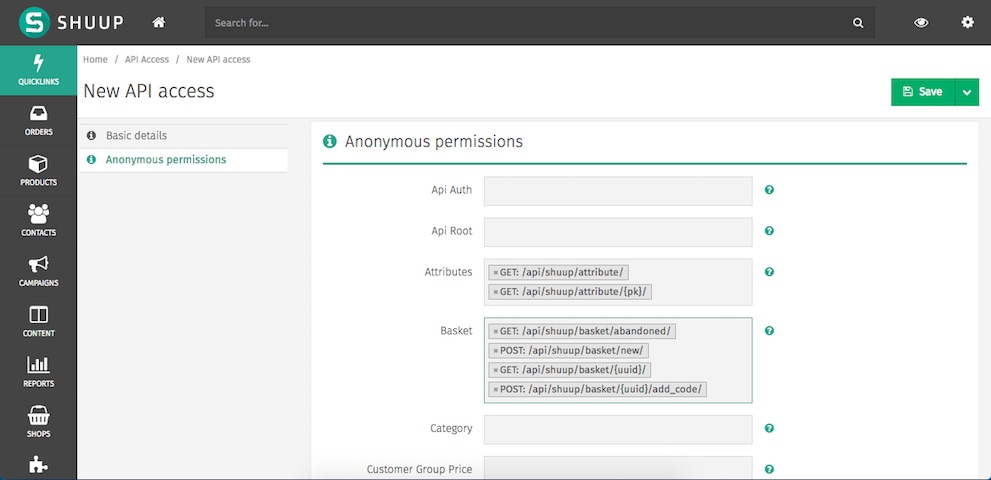
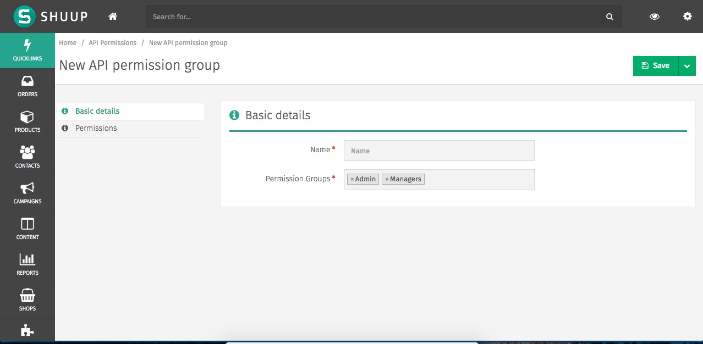
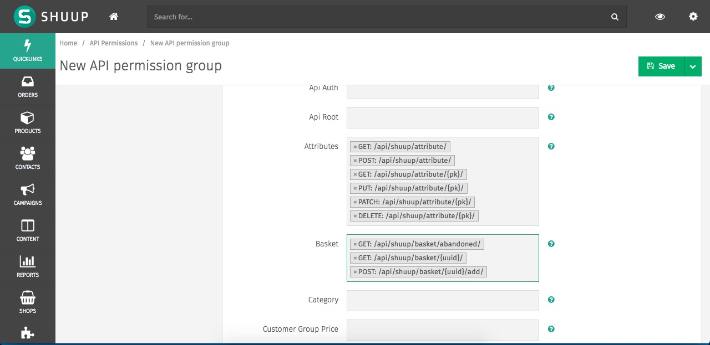

# Shuup API Permissions

Shuup module that adds more control over REST API access using JWT.

By using this module, all API requests should have a valid JWT, even when user is anonymous. The unique exception is the endpoint to acquire the JWT.

This way, only users which know the API key and secret can submit requests.

Each API key can have permissions configured for anonymous users and also for group of users (known as Permission Groups in Shuup) separately.

## Installation

`pip install shuup-api-permission`

## Configuration

In Django settings:

1. Add `shuup_api_permission` to `INSTALLED_APPS`.
2. Add `shuup_api_permission.middleware.ShuupAPIPermissionMiddleware` to `MIDDLEWARE_CLASSES`, the order doesn't matter.
3. Change `DEFAULT_AUTHENTICATION_CLASSES` to contain only `shuup_api_permission.authentication.APITokenAuthentication`. You can add other authentication classes if you prefer.
4. Change to `DEFAULT_PERMISSION_CLASSES` to:
```py
'DEFAULT_PERMISSION_CLASSES': (
    'shuup_api_permission.permissions.APIAccessPermission',
    'shuup_api_permission.permissions.APIScopePermission'
)
```
5. Add a custom JWT payload handler in `JWT_AUTH`:
```py
JWT_AUTH = {
    'JWT_PAYLOAD_HANDLER': 'shuup_api_permission.utils.jwt_payload_handler'
 }
```

Done.

# Using

### Creating API keys

After the configuration, you can create API keys to access Shuup APIs.

Enter in Shuup admin and go to menu **Settings** > **API Access** (in Other settings sub-menu).

Create a new API Access. Give a name like *Mobile App*. Here you can configure the permissions for anoymous users for each API endpoint and action:



In *Basic details* section, you can set whether the API Key is active or not. After disabling, the API key will no longer work, it means, all requests using that key will raise error.

You can also add permissions for user groups in **API permission groups** option. You should first create the permission scheme for a set of user groups. You can select existing ones or create a brand new right on the field "**+**" widget button. To manage these schemes, you can always access the menu **Settings** > **API Permissions**.

The basic information for this scheme (aka API Permission Group) is a name to identify the scheme, the list of user groups that will receive the permissions and, of course, the permissions set:





All authenticated users within those groups will have access to those permissions.

### Making requests

After created an API key with permissions set, it is time to use it.

First of all, create a request to obtain a JWT, the default endpoint is `/api/auth/` (considering your API url prefix is `api`. You can change this url (take a look at our [settings](shuup_api_permission/settings.py)).

For anonymous users:
```
POST /api/auth/ api_key=MY_KEY api_secret=MY_SECRET
```

For authenticated users:
```
POST /api/auth/ api_key=MY_KEY api_secret=MY_SECRET username=myuser password=qwerty
```

The response will contain a JWT that should be used in all subsequent API requests in the *Authorization* header.

```
GET /api/shuup/attributes/ Authorization:"JWT my-token-goes-here"
```

# Knwon Issues
- After changing permissions of an API Key, be anonymous permission or not, they won't be take effect for those users which acquired tokens before the change. It is a design decision. It is fastest to keep the user permissions inside the JWT that fetching them each time user makes a request. Thus, a token refresh solves the issue as the new token will have all the updated permission. So be careful when configuring the permissions and setting a good token refresh rate.

# TODOs

- [ ] Limit API keys by shop - keys can only be used for specific shops.
- [ ] Invalidate tokens with outdated permissions to prevent security flaws.

# License

MIT
